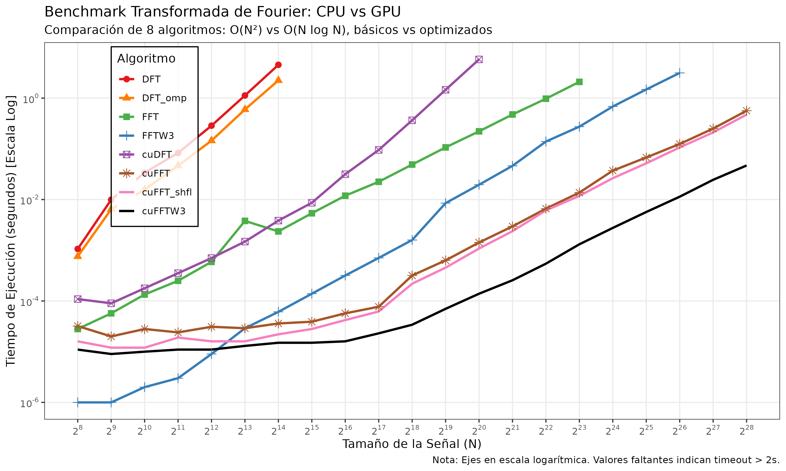

# FFT Benchmark: CPU vs GPU (Complexity Analysis)

Este proyecto realiza una comparación exhaustiva de rendimiento entre diferentes implementaciones de la Transformada Rápida de Fourier (FFT), contrastando algoritmos de fuerza bruta O(N²) contra algoritmos optimizados O(N log N), tanto en CPU como en GPU (CUDA).

## Algoritmos Comparados

### CPU (4 implementaciones)
1. **DFT** — DFT clásica O(N²) serial en CPU
2. **DFT_omp** — DFT O(N²) paralelizada con OpenMP
3. **FFT** — Cooley-Tukey recursivo O(N log N) (naive)
4. **FFTW3** — Librería FFTW3 optimizada O(N log N)

### GPU (4 implementaciones)
5. **cuDFT** — Kernel GPU de fuerza bruta O(N²)
6. **cuFFT** — FFT básico GPU O(N log N) sin optimizaciones (iterativo, solo memoria global)
7. **cuFFT_shfl** — FFT GPU O(N log N) optimizado con warp shuffle + shared memory
8. **cuFFTW3** — Librería NVIDIA cuFFT O(N log N)

## Resultados

El benchmark genera:
- **TiemposFFT.csv** — Datos tabulados con tiempos de ejecución
- **FT_comp.png** — Gráfico log-log comparativo



### Observaciones Clave

- **O(N²) vs O(N log N)**: Diferencia dramática para N > 2^16
- **CPU vs GPU**: La GPU domina para tamaños grandes (N > 2^18)
- **Progresión de optimizaciones GPU**:
  - cuDFT (O(N²)) → cuFFT (básico) → cuFFT_shfl (optimizado) → cuFFTW3 (librería)
  - Cada nivel muestra mejoras de 2-10× en rendimiento

## Requisitos

- **CUDA**: NVIDIA CUDA Toolkit (nvcc) con arquitectura sm_86+ (RTX 30xx/40xx)
- **FFTW3**: Librería `libfftw3-dev` / `fftw3-devel`
- **OpenMP**: Compilador con soporte OpenMP (gcc/g++)
- **R**: Para visualización (paquetes: `ggplot2`, `dplyr`, `tidyr`, `scales`)

## Compilación y Ejecución

```bash
# Compilar
make

# Ejecutar benchmark (genera TiemposFFT.csv)
./fft_comp

# Generar gráfico (crea FT_comp.png)
Rscript fft_comp.R
```

## Configuración

En `main.cpp`:
- `NUM_REPS` — Repeticiones por prueba (default: 3)
- `MAX_EXP` — Tamaño máximo 2^MAX_EXP (default: 27 = 128M elementos)
- Rango de prueba: 2^14 a 2^27 (ajustable según VRAM disponible)

## Detalles de Implementación

### cuFFT (básico)
- Iterativo multi-kernel (1 kernel por etapa FFT)
- Bit-reversal inicial + log2(N) etapas butterfly
- Solo memoria global, sin optimizaciones
- Equivalente GPU del FFT CPU recursivo

### cuFFT_shfl (optimizado)
- Etapas 0-4: Warp shuffle (intercambio intra-warp sin memoria)
- Etapas 5-9: Shared memory (bloques de hasta 1024 elementos)
- Etapas 10+: Kernels globales con ping-pong
- Optimizado para arquitectura Ampere (sm_86)

## Arquitectura de Pruebas

- **Hardware**: NVIDIA RTX 3050 (6GB VRAM, sm_86)
- **Precisión**: Single-precision (float32 / `float2`)
- **Timing**: CUDA events (GPU) / `omp_get_wtime()` (CPU)
- **Validación**: Comparación numérica con FFTW3/cuFFT

---

**(c) UABCS/DASC/manc**
